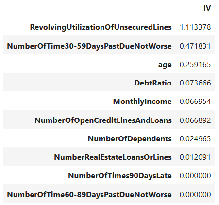
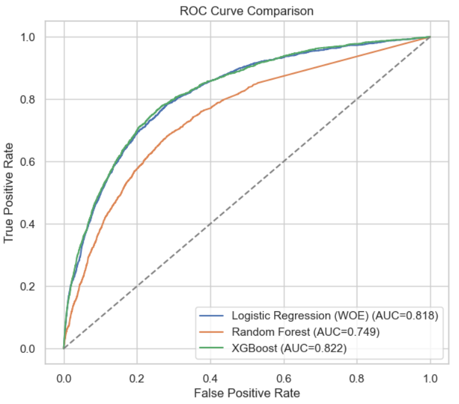
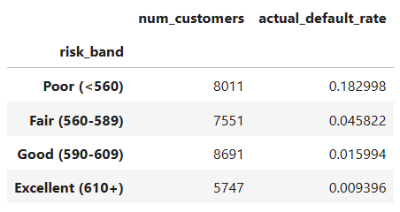
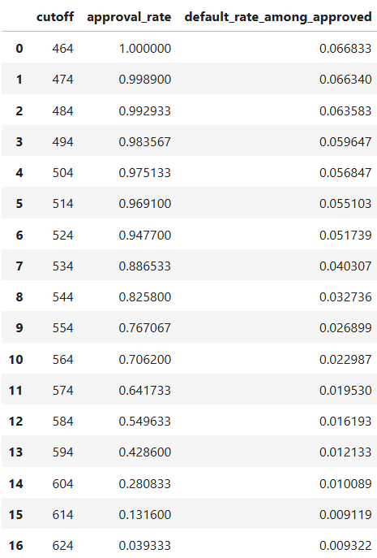
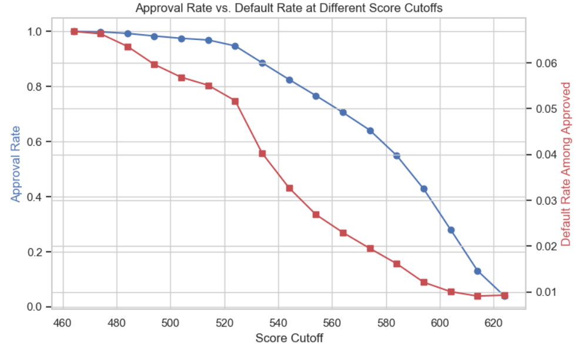
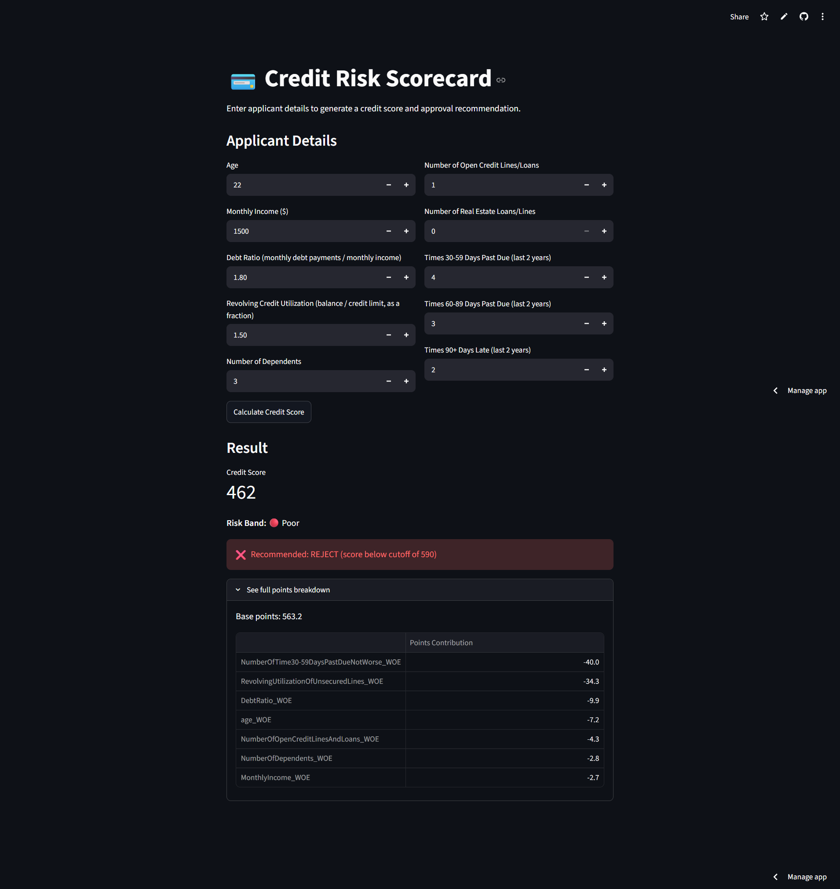
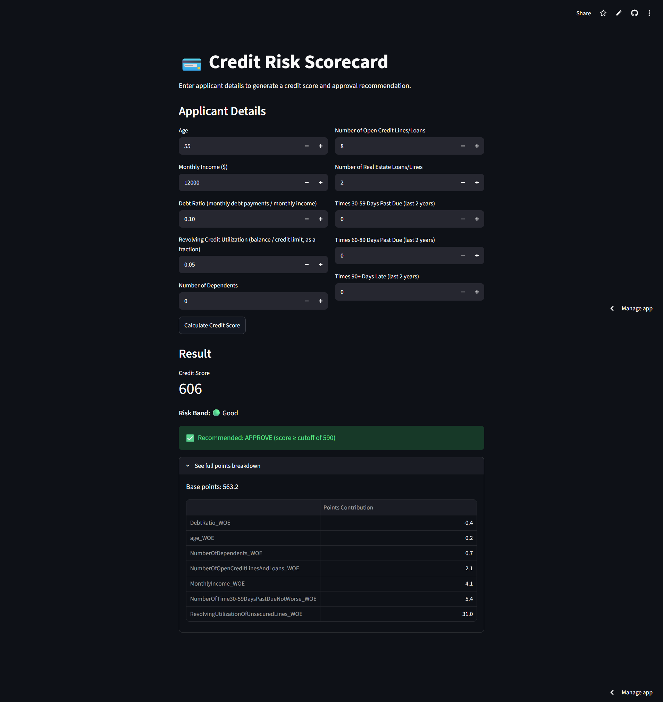

# Credit Risk Scoring

Predicting the probability that a loan applicant will experience serious financial distress, and converting that into a 300-850 style credit scorecard — the same approach banks use for lending decisions.

## Problem Statement

**Lending decisions require both accurate risk prediction and full explainability — an incorrect approval leads to defaults and lost capital, while an unexplainable rejection creates regulatory and fairness risk. This project builds a credit risk scorecard that predicts the probability of serious loan default while remaining fully transparent about exactly which factors drove each applicant's score, using the same WOE/IV and scorecard methodology real banks and lending institutions rely on.**

## Dataset

- **Source:** [Give Me Some Credit (Kaggle)](https://www.kaggle.com/c/GiveMeSomeCredit/data)
- **File used:** `cs-training.csv`
- **Target:** `SeriousDlqin2yrs` (1 = serious delinquency/default within 2 years, 0 = good standing)

## Approach

1. **EDA** — examined target imbalance (~93/7), found data quality issues (age=0 rows, placeholder codes in late-payment columns, extreme outliers in utilization/debt ratio)
2. **Cleaning** — fixed age outliers, capped placeholder codes, percentile-capped extreme values, imputed missing income/dependents
3. **WOE/IV Feature Selection** — binned every feature into deciles, computed Weight of Evidence and Information Value per feature, kept only features with real predictive power (IV ≥ 0.02)
4. **Modeling** — Logistic Regression on WOE-transformed features as the primary interpretable model; Random Forest and XGBoost as challenger models for comparison
5. **Evaluation** — ROC-AUC and the **KS-statistic** (the credit industry's standard separation metric)
6. **Credit Scorecard** — converted the Logistic Regression's log-odds output into a 300-850 style score with a full per-feature points breakdown, validated against actual default rate per risk band
7. **Business Framing** — modeled the approval-rate vs. default-rate tradeoff at different score cutoffs

## Key Results

*(Fill in with your actual numbers)*

| Model | ROC-AUC | KS-Statistic |
|---|---|---|
| Logistic Regression (WOE) | 0.818 | 0.052 |
| Random Forest | 0.749 | 0.4 |
| XGBoost | 0.822 | 0.511 |

**Top predictive features (by IV):**
**Top predictive features (by IV):**
1. **RevolvingUtilizationOfUnsecuredLines** — highest IV, flagged as statistically strong; how much of a customer's available credit they're currently using
2. **NumberOfTime30-59DaysPastDueNotWorse** — Strong; recent minor payment delays
3. **age** — Medium; older applicants tend to be lower risk

**Scorecard validation** — default rate by risk band:

| Risk Band | Default Rate |
|---|---|
| Poor (<560) | 18.30% |
| Fair (560-589) | 4.58% |
| Good (590-609) | 1.60% |
| Excellent (610+) | 0.94% |

## Business Meaning and impact

**This chart shows the trade-off between loan approvals and credit risk as the minimum approval score changes. As the cutoff increases, fewer applicants qualify (approval rate falls), but the applicants who *do* qualify are progressively lower-risk (default rate among approved customers falls too) — confirming the scorecard is genuinely separating high-risk from low-risk borrowers, not just ranking them randomly.**

**At a cutoff of 550, ~76% of applicants are approved with a 2.7% default rate among them. Raising the cutoff to 600 drops the default rate to ~1.0%, but approval rate falls sharply to ~28%. This lets a bank choose a threshold that balances growth (approval volume) against risk (default exposure) — exactly the kind of decision a real credit risk team makes.**

## How to Run

```bash
git clone <your-repo-url>
cd credit-risk-scoring

python -m venv venv
source venv/bin/activate   # or venv\Scripts\activate on Windows
pip install -r requirements.txt

jupyter notebook credit_project.ipynb

streamlit run app.py
```

🔗 [Try the app here](https://credit-risk-scoring-d3kx8c6ieqwygp7knkxqcu.streamlit.app/)

## Screenshots

**WOE/IV feature selection — predictive strength of each feature:**


**Model comparison — ROC curve across Logistic Regression, Random Forest, and XGBoost:**


**Scorecard validation — default rate by risk band:**


Default rate drops cleanly from **18.3%** in the Poor band down to **0.9%** in the Excellent band — a ~20x separation between the riskiest and safest customer segments, confirming the scorecard genuinely distinguishes risk levels rather than assigning scores randomly.

**Approval rate vs. default rate at different score cutoffs:**




This chart shows the trade-off between loan approvals and credit risk as the minimum approval score changes. As the cutoff increases, fewer applicants qualify (approval rate falls), but the applicants who *do* qualify are progressively lower-risk (default rate among approved customers falls too) — confirming the scorecard is genuinely separating high-risk from low-risk borrowers, not just ranking them randomly.

At a cutoff of 550, ~76% of applicants are approved with a 2.7% default rate among them. Raising the cutoff to 600 drops the default rate to ~1.0%, but approval rate falls sharply to ~28%. This lets a bank choose a threshold that balances growth (approval volume) against risk (default exposure) — exactly the kind of decision a real credit risk team makes.

**Live app — high-risk applicant (score 462, Poor band, Reject):**


**Live app — low-risk applicant (score 606, Good band, Approve):**


A **144-point spread** between the two extreme test profiles, with every feature contribution pointing the correct direction for each case — confirming the scorecard behaves consistently between its statistical validation (above) and real individual predictions.

## Tech Stack

Python · pandas · scikit-learn · XGBoost · WOE/IV (custom implementation) · Credit Scorecard methodology · Streamlit
